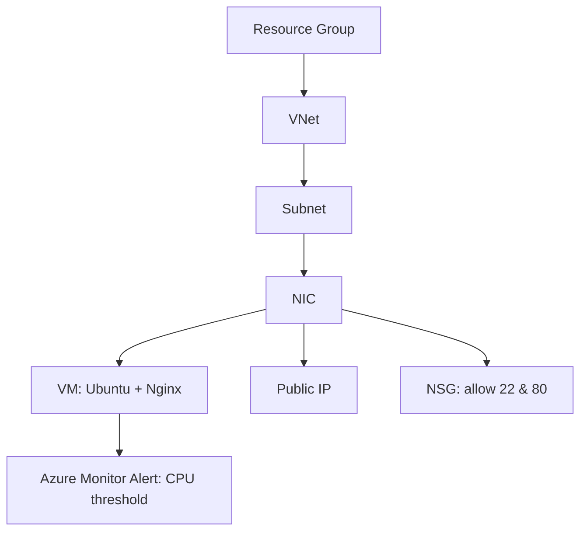
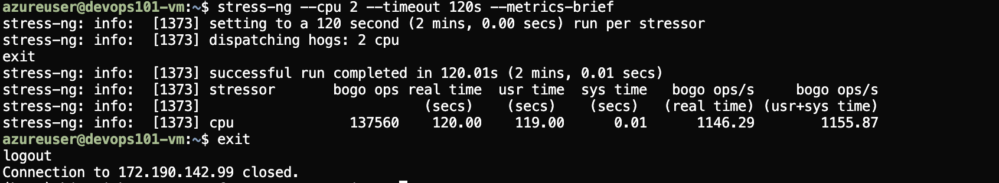
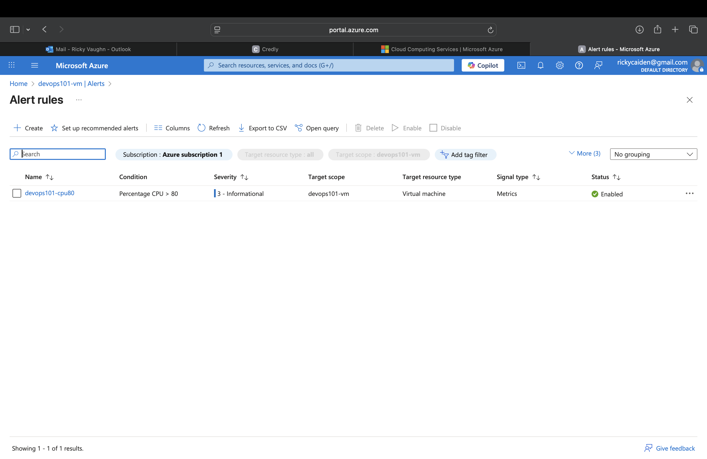

# Project 1: Azure VM with Nginx + Monitoring (Terraform)

## Overview
This project provisions a simple, cost-safe Azure environment using **Terraform**:
- Resource Group
- Networking (VNet, Subnet, NSG, Public IP, NIC)
- Ubuntu Linux VM with cloud-init installing **Nginx**
- Azure Monitor metric alert (CPU > 80%)

### Goals
- Learn provider-agnostic Terraform basics (portable to AWS).
- Practice least-privilege, IaC best practices, and cleanup with `terraform destroy`.
- Produce a professional GitHub-ready portfolio project.

---

## Architecture Diagram

 ## repo structure
terraform-azure-vm-nginx/
├── main.tf
├── variables.tf
├── outputs.tf
├── versions.tf
├── cloud-init.yaml
├── monitor.tf
└── README.md

## How to deploy
# 1. Init Terraform
terraform init

# 2. Format & validate
terraform fmt -recursive
terraform validate

# 3. Plan & apply
terraform plan -out tfplan
terraform apply tfplan

## How To Test
#Vist
echo $(terraform output -raw nginx_url)

# Stress CPU
$(terraform output -raw ssh_command)
sudo apt-get install -y stress-ng
stress-ng --cpu 2 --timeout 120s --metrics-brief

# Verify Alert
Portal: Azure Monitor → Alerts → Rule: devops101-cpu80
Check state or fired alert instance.
OR view metric graph (Percentage CPU spike).

##Cleanup
terraform destroy
